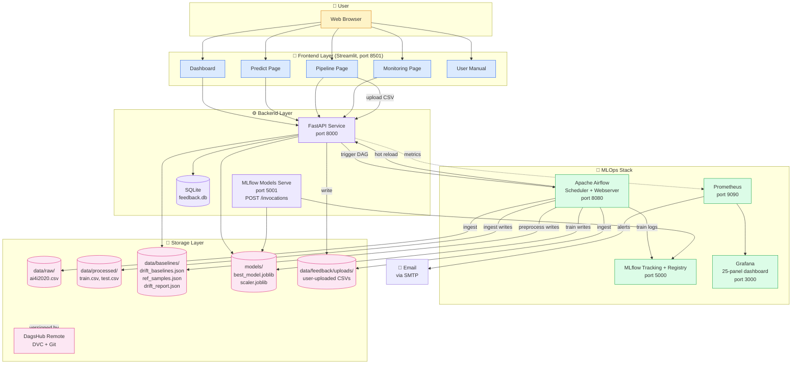

# Architecture Diagram

> Predictive Maintenance System — end-to-end MLOps pipeline for industrial machine failure prediction.

## System architecture (block diagram)

## ML pipeline DAG (reproducible via DVC + Airflow)

```mermaid
flowchart LR
    INGEST["📥 data_ingestion<br/>load + validate +<br/>drop leaky cols + split"]
    DRIFT["🔍 drift_check<br/>KS-test + PSI<br/>vs OLD baselines"]
    PREPROCESS["⚙️ preprocessing<br/>feature engineer<br/>+ scale + write<br/>NEW baselines"]
    RELOAD_BASELINES["🔄 reload_api_baselines<br/>(Airflow only)"]
    TRAIN["🎯 model_training<br/>RF grid search<br/>+ MLflow log + register"]
    RELOAD_MODEL["🔄 reload_api_model<br/>(Airflow only)"]
    BRANCH{"drift?"}
    NOTIFY["📧 retrain_notification<br/>email alert"]
    NODRIFT["✅ no_drift_end"]
    END["🏁 pipeline_end"]

    INGEST --> DRIFT --> PREPROCESS --> RELOAD_BASELINES --> TRAIN --> RELOAD_MODEL --> BRANCH
    BRANCH -- yes --> NOTIFY --> END
    BRANCH -- no --> NODRIFT --> END

    classDef step fill:#dbeafe,stroke:#2563eb
    classDef decision fill:#fef3c7,stroke:#d97706
    classDef alert fill:#fee2e2,stroke:#dc2626
    classDef done fill:#dcfce7,stroke:#16a34a
    class INGEST,DRIFT,PREPROCESS,TRAIN,RELOAD_BASELINES,RELOAD_MODEL step
    class BRANCH decision
    class NOTIFY alert
    class NODRIFT,END done
```

## Block descriptions

| Block | Role | Technology |
|---|---|---|
| **Dashboard / Predict / Pipeline / Monitoring / Manual** | Multi-page UI for non-technical users | Streamlit |
| **FastAPI Service** | Primary inference API; feedback loop; drift endpoint; admin endpoints (retrain, reload, rollback); Prometheus metrics exporter | FastAPI + Pydantic |
| **MLflow Models Serve** | Parallel MLflow-native inference endpoint at `POST /invocations` | `mlflow models serve` |
| **Apache Airflow** | Pipeline orchestration: ingest → drift_check → preprocess → train → drift_branch | Airflow 2.x |
| **MLflow Tracking + Registry** | Experiment tracking, model versioning, artifact storage | MLflow 2.x |
| **Prometheus** | Metrics scraping + alert rule evaluation | Prometheus |
| **Grafana** | NRT visualisation (25-panel dashboard) | Grafana |
| **SQLite (feedback.db)** | Lightweight store for prediction-feedback ground-truth labels | sqlite3 |
| **DagsHub Remote** | Off-host versioning of data + models via DVC | DVC + DagsHub |

## Data and control flow

1. **User uploads CSV** via the Pipeline page → POST to `/retrain/upload` on the API.
2. **API persists** the file to `data/feedback/uploads/` and triggers the Airflow DAG via the Airflow REST API.
3. **Airflow ingests** the latest upload (filename-timestamp ordered), drops leaky columns, splits, writes `train.csv` + `test.csv`.
4. **Airflow runs drift_check** against the *previous* baselines on disk (this is the architectural fix — runs *before* preprocess overwrites baselines).
5. **Airflow runs preprocessing** — feature engineering, scaling, computes new drift baselines + reference samples, persists them.
6. **Airflow hot-reloads** the new baselines into the running FastAPI container (`POST /admin/reload-baselines`).
7. **Airflow runs training** — RandomForest grid search, logs all runs to MLflow, registers the best model in the registry.
8. **Airflow hot-reloads** the new model into FastAPI (`POST /admin/reload-model`).
9. **Branch task** routes to `retrain_notification` (sends drift + retrain emails) if drift was real, or `no_drift_end` otherwise.
10. **Prometheus scrapes** API metrics every 15s; **Grafana** renders them in 25 panels; **AlertManager rules** fire emails on `MultipleFeaturesDrifted`, `RetrainStorm`, etc.

## Loose coupling guarantees

- Frontend and backend communicate **only** via REST (`common.APIClient`).
- Frontend's `API_URL` is configurable via env var (`http://api:8000` in Docker, `http://localhost:8000` locally).
- The FastAPI container can be replaced or scaled independently of Streamlit.
- The Airflow DAG hot-reloads the API via HTTP, never sharing in-process state.